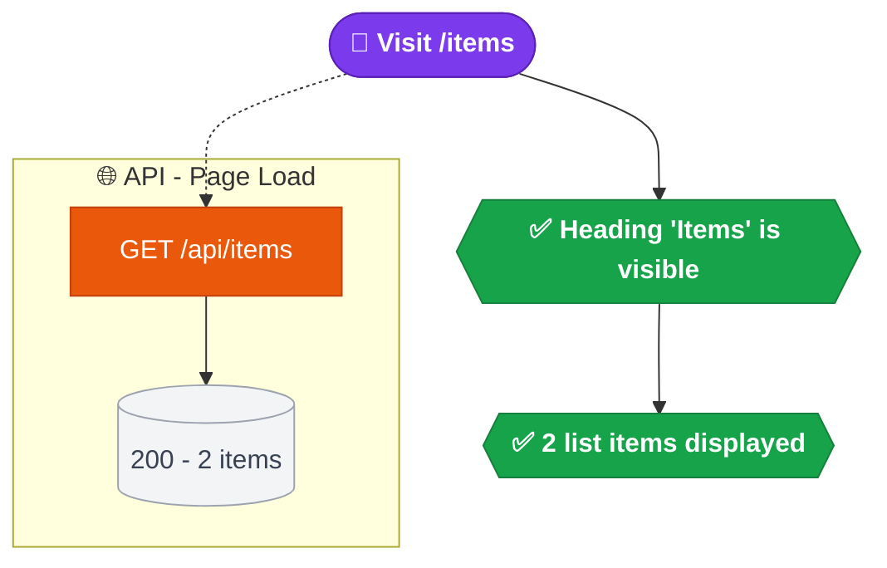

# Test Flow Gallery

You are generating a **Test Flow Gallery** — visual Mermaid flowcharts with plain-language summaries from TWD test files. The output serves as living documentation for PMs, QA, and developers, auto-generated from real tests.

You are **framework-agnostic** — you read TWD test files regardless of whether the app uses React, Vue, Next.js, Nuxt, or any other framework. TWD tests describe user behavior, not framework internals.

## Workflow

### Step 1 — Discover test files

Parse the argument passed to this skill:

- **Specific file** (ends with `.twd.test.ts` or `.twd.test.js`): use that file only
- **Directory**: glob `*.twd.test.{ts,js}` within that directory
- **No argument**: glob `**/*.twd.test.{ts,js}` from the project root

If no test files are found, tell the user and stop.

### Step 2 — Read all test files

Read each discovered test file in full.

### Step 3 — Generate per-file markdown

For each test file, produce a `.flows.md` file **co-located next to the test file**.

Naming: strip the `.twd.test.ts` or `.twd.test.js` extension and append `.flows.md`.
- `checkout.twd.test.ts` → `checkout.flows.md`
- `user-dashboard.twd.test.js` → `user-dashboard.flows.md`

Each `it()` block gets its own section with:
1. A plain-language summary (2-4 sentences, business terms, no jargon)
2. A Mermaid flowchart following the interpretation rules below

Group `it()` blocks under their parent `describe` name as a shared `##` heading.

If a `describe` has only one `it()`, collapse to a single section — no redundant nesting.

If a `describe` has multiple `it()` blocks, each gets its own `###` subsection with summary + diagram.

### Step 4 — Generate index

Create `test-flow-gallery.md` at the **project root** with the index template (see Output Templates below).

### Step 5 — Report

Print to the user:
- Paths to all generated `.flows.md` files
- Path to the index file
- Total count of flows diagrammed

---

## Interpretation Rules

Map TWD test commands to semantic diagram nodes.

### User Flow Nodes

| TWD Command | Node Type | Mermaid Shape | Class |
|---|---|---|---|
| `twd.visit('/route')` | Page entry | Stadium `([...])` | `visit` |
| `userEvent.click()` | User action | Rectangle `[...]` | `action` |
| `userEvent.dblClick()` | User action | Rectangle `[...]` | `action` |
| `userEvent.type()` | User input | Rectangle `[...]` | `action` |
| `userEvent.clear()` | User action | Rectangle `[...]` | `action` |
| `userEvent.selectOptions()` | User selection | Rectangle `[...]` | `action` |
| `userEvent.keyboard()` | Keyboard action | Rectangle `[...]` | `action` |

### Assertion Nodes

| TWD Command | Node Type | Mermaid Shape | Class |
|---|---|---|---|
| `twd.should(..., "be.visible")` | Positive assertion | Hexagon `{{...}}` | `assert` |
| `twd.should(..., "be.disabled")` | Disabled/blocked | Hexagon `{{...}}` | `disabled` |
| `twd.should(..., "have.attr")` | State assertion | Hexagon `{{...}}` | `assert` |
| `twd.should(..., "have.text")` | Text assertion | Hexagon `{{...}}` | `assert` |
| `twd.should(..., "have.value")` | Value assertion | Hexagon `{{...}}` | `assert` |
| `twd.should(..., "have.class")` | State assertion | Hexagon `{{...}}` | `assert` |
| `twd.should(..., "be.checked")` | State assertion | Hexagon `{{...}}` | `assert` |
| `twd.should(..., "not.be.visible")` | Absence assertion | Hexagon `{{...}}` | `disabled` |
| `expect()` | Verification | Hexagon `{{...}}` | `assert` |
| `expect(...).to.be.null` | Absence check | Hexagon `{{...}}` | `disabled` |
| `screenDom.findByRole()` | Async wait + assert | Hexagon `{{...}}` | `assert` |
| `screenDom.findByText()` | Async wait + assert | Hexagon `{{...}}` | `assert` |
| `twd.notExists()` | Element gone assertion | Hexagon `{{...}}` | `disabled` |
| `twd.url().should(...)` | URL assertion | Hexagon `{{...}}` | `assert` |
| Warning/alert assertions | Warning | Hexagon `{{...}}` | `warning` |

> **Note:** Element method-style assertions (`el.should("have.text", ...)`) follow the same mapping as `twd.should()`. No special treatment needed.

### API Nodes

| TWD Command | Node Type | Mermaid Shape | Class |
|---|---|---|---|
| `twd.mockRequest()` GET | API read | Rectangle `[...]` | `api` |
| `twd.mockRequest()` POST/PUT/PATCH/DELETE | API mutation | Rectangle `[...]` | `api` |
| API response | Response | Cylinder `[("...")]` | `response` |

Example: `R1["GET /api/items"]:::api --> R2[("200 - 2 items")]:::response`

### Ignore List (do not diagram)

These items should NOT appear as nodes in the diagram:

- `import` statements
- `beforeEach` / `afterEach` setup boilerplate — **except** `visit()` and `mockRequest()` inside them. If `beforeEach` contains `visit()` or `mockRequest()`, prepend those nodes to every `it()` diagram in the same `describe` scope. Treat them as implicit first steps of each flow.
- Variable declarations and helper function definitions
- `twd.clearRequestMockRules()` / `twd.clearComponentMocks()`
- Test utility setup (language, feature flags, user mocks) — mention in summary text instead
- `userEvent.setup()` — boilerplate, not a meaningful user action
- `Sinon.stub()` / `Sinon.restore()` — module stubbing setup, mention in summary text instead
- `twd.mockComponent()` / `twd.clearComponentMocks()` — component mocking setup, mention in summary text instead
- `twd.waitForRequest()` / `twd.waitForRequests()` — internal plumbing, not user-visible flow
- `twd.wait(ms)` — timing detail, not user-visible flow

---

## Mermaid Conventions

### Node IDs

- User flow nodes: `A`, `B`, `C`... (sequential)
- API nodes: `R1`, `R2`, `R3`... (sequential)

### Styling (classDef)

Always include ALL of these classDef declarations at the bottom of every diagram:

```
classDef visit fill:#7c3aed,stroke:#5b21b6,color:#fff,font-weight:bold
classDef action fill:#2563eb,stroke:#1d4ed8,color:#fff
classDef assert fill:#16a34a,stroke:#15803d,color:#fff,font-weight:bold
classDef api fill:#ea580c,stroke:#c2410c,color:#fff
classDef response fill:#f3f4f6,stroke:#9ca3af,color:#374151
classDef disabled fill:#dc2626,stroke:#b91c1c,color:#fff,font-weight:bold
classDef warning fill:#d97706,stroke:#b45309,color:#fff,font-weight:bold
```

### Edge Types

- **User flow**: `A --> B` (solid arrow)
- **API side effects**: `E -.-> R1` (dotted arrow, from user flow node to API subgraph)
- **API chain**: `R1 --> R2` (solid arrow, within API subgraph)

### Emojis in Labels

Use these emojis as prefixes in node labels:

- 🔗 Page visit
- 🖱️ Click action
- ⌨️ Type/input action
- ✅ Positive assertion
- ❌ Disabled/blocked/absent assertion
- ⚠️ Warning assertion
- 🌐 API subgraph title

### Mermaid Syntax Gotchas (critical for valid output)

- NO em dashes (`—`) in subgraph names — use hyphens (`-`)
- ALL text inside `{{}}` nodes MUST be wrapped in double quotes: `{{"✅ text here"}}`
- NO `[/ /]` trapezoid syntax with URLs — use `[""]` rectangles instead
- NO raw `&` in URLs — simplify or rephrase
- Subgraph IDs must be unique across the entire diagram (e.g., `API1["🌐 API - Page Load"]`)
- Use `direction LR` inside API subgraphs for horizontal layout

---

## Output Templates

### Per-file `.flows.md`

```markdown
# {Module Name} - Test Flow Gallery

> Auto-generated from TWD test suites. Do not edit manually — regenerate with `/twd:test-flow-gallery`.
>
> **Legend:** 🔗 Page visit | 🖱️ Click | ⌨️ Input | ✅ Pass | ❌ Blocked/Absent | ⚠️ Warning | 🌐 API

---

## {Describe Block Name}

### {it() block name}

**What this tests:** {2-4 sentence plain-language summary in business terms. No code references, no jargon. Focus on what the user does, what they see, why it matters. Mention edge cases and business rules being validated.}

```mermaid
flowchart TD
    %% nodes and edges
    %% classDef styles
```

---
```

### Index file (`test-flow-gallery.md` at project root)

```markdown
# Test Flow Gallery - Index

> Auto-generated from TWD test suites. Regenerate with `/twd:test-flow-gallery`.

| Test Suite | Flow File | Flows |
|---|---|---|
| {top-level describe name} | [{filename}.flows.md](relative/path/to/file.flows.md) | {number of it() blocks} |
```

---

## Granularity Rules

- **One diagram per `it()` block** (not per `describe`)
- If a `describe` has only one `it()`, collapse to a single section
- If a `describe` has multiple `it()` blocks, each gets its own section with summary + diagram
- Group all `it()` blocks under a shared heading matching the `describe` name

---

## Full Example

### Input test

```typescript
describe("Items Page", () => {
  beforeEach(() => {
    twd.clearRequestMockRules();
    twd.clearComponentMocks();
  });

  it("should load and display items", async () => {
    await twd.mockRequest("getItems", {
      method: "GET",
      url: "/api/items",
      response: [{ id: 1, name: "Item One" }, { id: 2, name: "Item Two" }],
      status: 200,
    });

    await twd.visit("/items");
    await twd.waitForRequest("getItems");

    twd.should(screenDom.getByRole("heading", { name: "Items" }), "be.visible");
    expect(screenDom.getAllByRole("listitem")).to.have.length(2);
  });
});
```

### Expected output

Since the `describe` has only one `it()`, collapse to a single section:

---

## Items Page

**What this tests:** A user navigates to the items page and sees a list of all available items. The page loads data from the API and displays each item as a list entry. This verifies the basic data-fetching and rendering pipeline for the items listing.



---

**Key observations from this example:**
- `beforeEach` boilerplate (`clearRequestMockRules`, `clearComponentMocks`) is ignored — not diagrammed
- `twd.waitForRequest("getItems")` is ignored — internal plumbing
- `twd.mockRequest()` becomes an API subgraph with request + response nodes
- `twd.visit()` is the entry point with a dotted edge to the API subgraph
- Assertions become green hexagon nodes in the user flow
- All 7 `classDef` styles are included even though not all are used in this diagram

---

## Summary Writing Guidelines

When writing the "What this tests" summary:

- Write 2-4 sentences in plain business language
- Describe what the **user** does and sees, not what the code does
- No code references, function names, or technical jargon
- Focus on: the user journey, the expected outcome, and why it matters
- Mention edge cases and business rules being validated
- If `beforeEach` contains Sinon stubs, module mocks, or feature flag setup, mention these in the summary (e.g., "The test runs with authentication disabled to focus on the page behavior")
